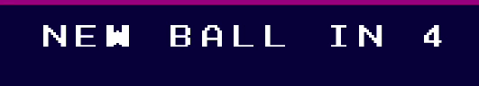

# LDTS_T13_G06 - RETRO LEAGUE

## Game Description

The Retro League is a game inspired by the Lethal League game, a 2D arena fighting game. 

In this game, one player is put into an arena where he has to avoid being hit by a ball for as long as he can. However, there are a few tricks to it as there are power-ups that can change the game's outcome by affecting the ball and the player, and the ball bounces off the walls which can lead to a player beign hit unexpectedly,

testing the player's strategy and reflexes.

This project was developed by:
- Afonso Saraiva (up202304461@fe.up.pt)
- Daniel Marques (up202306365@fe.up.pt)
- Inês Francisco (up202304726@fe.up.pt)

for LDTS 2024/2025.

Enjoy playing this game and challenge your friends to beat your survival time, just be careful not to get hit and killed too quickly.

For a more detailed version of this description click [here](./docs/README.md) 

## Screenshots
The following screenshots ilustrate the game's general look, including the different menus and the game's arena as well as other functionalities:

### Game Title

  

  <b><i>Fig 1. Game title</i></b>

  

### Game Preview

  

  <b><i>Gif 1. Sneak peak into Retro League game</i></b>

 
 

### Menus

  

  <b><i>Gif 2. Main Menu</i></b>

 
 

  

  <b><i>Fig 2. Instructions Menu </i></b>  

  

 
 

  

  <b><i>Fig 3. Leaderboard Menu </i></b>

### Power-ups

  

  <b><i>Gif 3. Freeze ball</i></b>

 
 

  

  <b><i>Gif 4. Speed Up ball</i></b>

 
 

  

  <b><i>Gif 5. Slow down ball</i></b>

 
 

  

  <b><i>Gif 6. Player's jump boost</i></b>

 
 

  

  <b><i>Gif 7. Double damage ball</i></b>

 
 

### Animations

  

  <b><i>Gif 8. Player lives' tracker</i></b>

 
 

  

  <b><i>Gif 9. Survival Timer</i></b>

 
 

  

  <b><i>Gif 10. Countdown to new ball</i></b>

 
 

  

  <b><i>Gif 11. Saving survival time</i></b>

 
 

### End Game

  

  <b><i>Gif 12. End Game</i></b>

