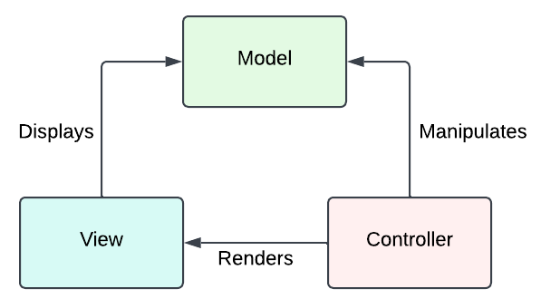
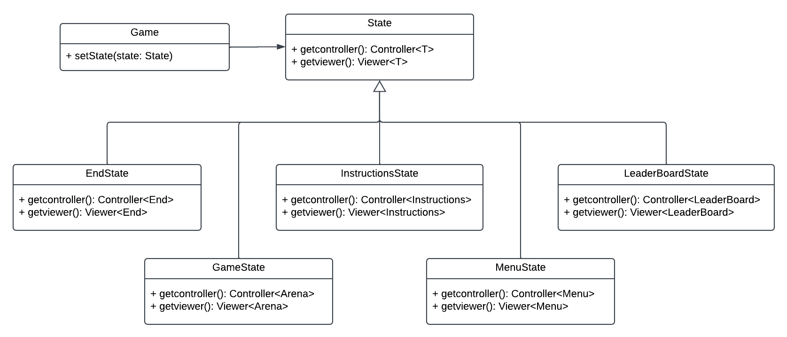
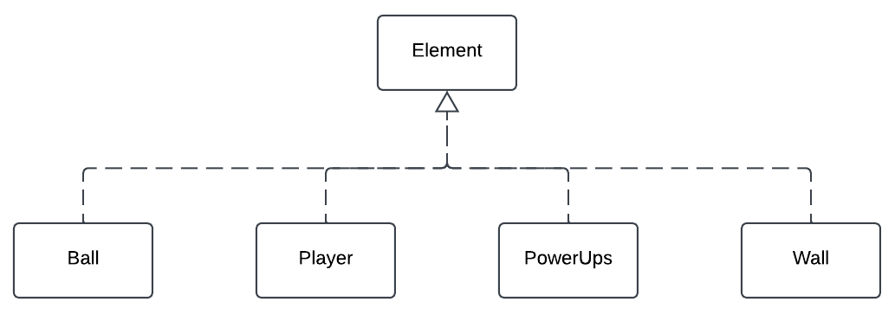
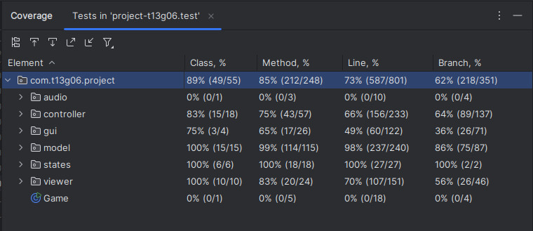

# LDTS_T13_G06 - RETRO LEAGUE

## Game Description

The Retro League is a game inspired by the Lethal League game, a 2D arena fighting game. 

In this game, one player is put into an arena where he has to avoid being hit by a ball for as long as he can. However, there are a few tricks to it as there are power-ups that can change the game's outcome by affecting the ball and the player, and the ball bounces off the walls which can lead to a player beign hit unexpectedly,

testing the player's strategy and reflexes.

This project was developed by:
- Afonso Saraiva (up202304461@fe.up.pt)
- Daniel Marques (up202306365@fe.up.pt)
- Inês Francisco (up202304726@fe.up.pt)

for LDTS 2024/2025.

Enjoy playing this game and challenge your friends to beat your survival time, just be careful not to get hit and killed too quickly.

## Implemented Features

- **Playable Character** - the game will has one playable characters that can be controlled by pressing:
    - `LEFT`, `RIGHT` and `UP`

  to move left, right and to jump, respectively.

- **Main Menu** - the game has a main menu when we first open the game. It has the following options:
    - `START` : starts a "new" game
    - `LEADERBOARD` : displays the top 10 survival times by descending order of time
    - `INSTRUCTIONS` : presents the instructions of the game as well as a brief explanation of what every power-up does and how the game's player can be controlled
    - `EXIT` : exits the game - while playing you can also quit the game by pressing `q`)

- **Walls & Platforms** - the game's walls and platforms work almost like a trampoline allowing the ball to bounce off them and, consequently, change their trajectory

- **Collision Detection** - The game detects collisions between the ball and the walls and platforms as well as between the ball and the player. When the ball collides with the player, he looses a life and can, eventually, die ending the game. It also detects collisions between the player and the power-ups, activating them for a certain period of time

- **End Game Screen** - the game shows a End Game Screen when the player dies, displaying how long he survived

- **Power-ups** - the game has power-ups that the player can collect. Each one of them has a different consequence, for a short period of time:
    -  `Freeze` : freezes the balls
    -  `Speed Up` : boosts the balls' velocity (making it harder for the player to avoid getting hit)
    -  `Slow Down` : reduces the ball's speed (making it easier for the player to avoid getting hit)
    -  `Turbo` : boosts the player's jump capacity
    -  `Shockwave` : doubles the ball's strength (duplicating the damage it gives to the player when hit by it)

  being able to change the odds of the game if chosen correctly

- **Background Music** - the game has background music

## Planned Feautures

All the features were implemented and completed.

## Design

### General Structure of the code
**Problem in context**

With the increase of the complexity of the game, the code became more difficult to understand and maintain. So, we needed to find an appropriate pattern to organize it.

**The Pattern**

The main pattern applied to the project is the Architectural Pattern, more specifically the Model-View-Controller style which is commonly used in a GUI. 

**Implementation**
This pattern was useful because it allowed us to divide the code in three parts, or class groups: model, view and controller. 
- The model classes are responsible for the data storage
- The view classes control the visual interface and, therefore, the visual effects on the screen
- The controller classes are responsible for the logic of the game

  All three parts are independent and work together to make the game work as follows:

  

  <b><i>Fig 1. Model, Controller and Viewer pattern design</i></b>

**Consequences**

A modular structure of the code allowing us to divide the code in different files can be very usefull for many reasons, but it can also not be an easy task to do. This meant that when we were developing the code we needed to think about the structure of the code and how we were going to divide it. This was, in fact, a hard task at the beginning. However, as the times went on we were able to get used to it and benefit from it, being able to:
- make cooperation easier
- well organize our code
- easily add new features throughout the development stage

### Game State
**Problem in context**

It is easy to verify that the whole game has several states, such as the main menu, the game itself, the end game screen, etc. So, the program needed to be able to handle these states in a simple and efficient way. In addition, we needed to easily change the game state when the user interacted with the game. For example, if the players dies, the game state is set to the end game screen.

**The Pattern**

The State pattern is a behavioral design pattern that allows an object to change its behavior depending on its current state and when its internal state was altered.

**Implementation**

This way, the different states of our program allowed the game to alter its behavior in a simple and efficient way, and were implemented in the following manner:

  

  <b><i>Fig 2. State pattern design</i></b>

**Consequences**

The game state is defined in the Game class which is usefull since:
- we can change the state of the game by calling the setState method
- the different states are explicit and there is no need to rely on a series of flags

### Factory
**Problem in context**

The game contains an aglomeration of elements such as a player, a ball and power-ups that have different effects on the player and ball. This way having a design pattern that allows us to create specific elements through a generalized class is way more effective than creating a different class for each element.

**The Pattern**

The Factory Method is a creational design that defines an interface for creating objects in a superclass, but lets subclasses decide which class to instantiate, or, in other words, alter the type of objects that will be created.

**Implementation**

A factory is responsible for constructing the whole but the workers are the ones that actually execute the job. Bringing this into the program's context, our Element class works as the factory, being able to construct the game's different objects specified above, and its subclasses represent the workers which can supply the necessary component to well define the objects various characteristics.

  

  <b><i>Fig 3. Factory pattern design</i></b>

**Consequences**

This method brings benefits as it:
- allows us to reuse construction code when creating multiple power-ups or different elements
- makes it easier to, for example, introduce new elements (if we changeed the game for two players) without breaking the current implemented code

### Code Smells

**Opening Game Terminal**
Our game opens in full screen everytime which is a problem since, opening the terminal like this, only displays our game correctly in computer screens of size 1920x1280. When the computer's screen is not the one specificated, to correctly view our game, the user will need to reduce the full screen window and change its size until it shows the terminal without visual bugs, displaying then the game correctly.

## Testing

### Screenshot of coverage report

  

  <b><i>Fig 4. Code coverage screenshot</i></b>

### Link to mutation testing report
[Mutation tests](../docs/pitest/index.html)

## Self-evaluation

The work was divided in a mutual way and we all contributed to garantee the end result was the best one possible.

- Afonso Saraiva: 33,3%
- Daniel Marques: 33,3%
- Inês Francisco: 33,3%
